# Ara Voice Assistant — Product Requirements Document

**Version:** 1.2  
**Date:** January 12, 2026  
**Author:** Ammar Darkazanli  
**Status:** Draft

---

## Executive Summary

Ara is a privacy-first, offline-capable voice assistant designed to run on edge hardware (Raspberry Pi 4) and development machines (macOS/Linux laptops). The system prioritizes low latency, high accuracy, and complete functionality without internet connectivity, while supporting on-demand cloud features when available. All interactions are logged and compiled into structured daily summaries for extended use beyond individual sessions.

---

## Product Vision

**"A voice assistant that respects your privacy, works anywhere, and remembers everything."**

Ara differentiates from cloud-dependent assistants (Alexa, Google Assistant, Siri) by:
- Operating fully offline with no data leaving the device
- Providing consistent performance regardless of network availability
- Maintaining comprehensive conversation history under user control
- Supporting seamless internet connectivity for enhanced capabilities when desired
- Running identically on development laptops and production Pi hardware

---

## Target Environments

### Production Environments

| Environment | Primary Use Cases | Hardware Config |
|-------------|-------------------|-----------------|
| **Kitchen** | Timers, recipes, unit conversions, hands-free queries | Pi 4 + USB mic + speaker |
| **Car** | Navigation queries, reminders, hands-free messaging | Pi 4 + car audio integration |
| **Office** | Quick calculations, note-taking, schedule queries | Pi 4 + desk mic setup |

### Development Environment

| Environment | Primary Use Cases | Hardware Config |
|-------------|-------------------|-----------------|
| **Laptop (macOS/Linux)** | Development, testing, debugging, model evaluation | Built-in mic + speakers or USB audio |

---

## Core Requirements

### 1. Offline-First Operation

**Requirement:** Ara must function completely without internet connectivity.

| Component | Offline Solution | Fallback |
|-----------|------------------|----------|
| Wake Word Detection | Local model (Porcupine/OpenWake) | Always local |
| Speech-to-Text (STT) | Whisper.cpp (local) | Cloud STT when online |
| Language Model (LLM) | Llama 3.2 3B / Phi-3 Mini (local) | Claude API when online |
| Text-to-Speech (TTS) | Piper TTS (local) | Cloud TTS when online |

**Acceptance Criteria:**
- [ ] System boots and responds to wake word with no network
- [ ] Full conversation flow works in airplane mode
- [ ] No errors or degraded UX when offline
- [ ] Clear indication of online/offline status
- [ ] Identical behavior on Pi 4 and development laptop

---

### 2. Latency Requirements

**Target:** Sub-2-second end-to-end response time for typical queries.

| Stage | Target (Pi 4) | Target (Laptop) | Maximum Acceptable |
|-------|---------------|-----------------|-------------------|
| Wake word detection | < 100ms | < 50ms | 200ms |
| Speech-to-Text | < 500ms | < 200ms | 1000ms |
| LLM inference | < 800ms | < 300ms | 1500ms |
| Text-to-Speech | < 300ms | < 150ms | 500ms |
| **Total E2E** | **< 1.7s** | **< 0.7s** | **< 3.2s** |

**Optimization Strategies:**
- Streaming STT (process as audio arrives)
- Streaming TTS (begin playback before full generation)
- Model quantization (Q4_K_M or Q5_K_M for LLM)
- Warm model loading (keep models in memory)
- Audio pipeline optimization (minimal buffer sizes)
- GPU acceleration on laptop (Metal/CUDA when available)

**Measurement:**
- Log timestamps at each pipeline stage
- Report P50, P95, P99 latencies in daily logs
- Alert if P95 exceeds maximum acceptable

---

### 3. Accuracy Requirements

**Target:** ≥95% intent recognition accuracy for supported commands.

| Component | Accuracy Target | Measurement Method |
|-----------|-----------------|-------------------|
| Wake word | ≥98% true positive, <1% false positive | Weekly sampling test |
| STT transcription | ≥95% WER (Word Error Rate) | Compare to manual transcripts |
| Intent classification | ≥95% correct intent | Tagged conversation review |
| Response quality | ≥90% user satisfaction | Implicit feedback (follow-ups, corrections) |

**Quality Assurance:**
- Maintain test utterance library (100+ phrases)
- Weekly automated accuracy benchmarks
- Log all corrections/clarifications as training signal
- CI/CD pipeline runs accuracy tests on every commit

---

### 4. On-Demand Internet Connectivity

**Requirement:** Enhanced capabilities when connected, graceful operation when not.

#### Connectivity Modes

| Mode | Trigger | Behavior |
|------|---------|----------|
| **Offline** | No network detected | Local models only, full functionality |
| **Online - Local Preferred** | Network available, user preference | Use local models, cloud for overflow |
| **Online - Cloud Enhanced** | User request or complex query | Route to cloud APIs for higher quality |

#### Cloud Features (When Online)

| Feature | Cloud Service | Trigger |
|---------|---------------|---------|
| Complex reasoning | Claude API | "Think deeply about..." or query complexity score |
| Web search | Search API | "Search for...", "What's the latest..." |
| Real-time data | Weather/News APIs | Time-sensitive queries |
| Large context | Claude API | Conversation exceeds local context window |
| Voice cloning/custom TTS | Cloud TTS | User preference for specific voice |

#### Network State Machine


**User Controls:**
- "Ara, go offline" — Force offline mode
- "Ara, go online" — Enable cloud features
- "Ara, what mode are you in?" — Report current status

---

### 5. Conversation Logging & Daily Compilation

**Requirement:** All interactions logged and compiled into structured daily summaries.

#### Logging Data Flow


#### Log Structure

**Per-Interaction Log (JSON Lines):**
```json
{
  "timestamp": "2026-01-12T14:32:15.123Z",
  "session_id": "ses_abc123",
  "interaction_id": "int_xyz789",
  "device": "pi4-kitchen",
  "wake_word_confidence": 0.94,
  "audio_duration_ms": 2340,
  "transcript": "What time is my dentist appointment tomorrow",
  "transcript_confidence": 0.97,
  "intent": "calendar_query",
  "intent_confidence": 0.92,
  "entities": {
    "event_type": "dentist appointment",
    "time_reference": "tomorrow"
  },
  "response": "Your dentist appointment is tomorrow at 2:30 PM at Smile Dental on Main Street.",
  "response_source": "local_llm",
  "latency_ms": {
    "wake_word": 45,
    "stt": 412,
    "llm": 623,
    "tts": 198,
    "total": 1278
  },
  "mode": "offline",
  "error": null
}
```

**Daily Summary (Markdown):**
```markdown
# Ara Daily Log — 2026-01-12

## Summary Statistics
- Total interactions: 47
- Successful: 45 (95.7%)
- Errors: 2 (4.3%)
- Average latency: 1,342ms
- Mode breakdown: Offline 89%, Online 11%

## Top Intents
1. timer_set (12)
2. weather_query (8)
3. general_question (7)
4. reminder_create (6)

## Notable Interactions
### Complex Query Routed to Cloud
- **Time:** 14:32
- **Query:** "Explain the difference between RAFT and Paxos consensus algorithms"
- **Routing:** Local → Cloud (complexity threshold exceeded)
- **Response time:** 3.2s

### Error: STT Failure
- **Time:** 18:45
- **Audio duration:** 8.2s
- **Error:** Transcription timeout (audio too long)
- **Resolution:** Suggest shorter queries

## Action Items Extracted
- [ ] Dentist appointment tomorrow 2:30 PM
- [ ] Call mom this weekend
- [ ] Buy milk and eggs

## Insights
- Peak usage: 7:00-8:00 AM (morning routine)
- Most common correction: "Alexa" misheard as wake word
```

#### Storage & Retention

| Data Type | Location | Retention |
|-----------|----------|-----------|
| Raw audio | Not stored by default | Optional: 24 hours |
| Interaction logs | `~/ara/logs/YYYY-MM-DD.jsonl` | 90 days |
| Daily summaries | `~/ara/summaries/YYYY-MM-DD.md` | Indefinite |
| Aggregated metrics | `~/ara/metrics/monthly/YYYY-MM.json` | Indefinite |

#### Export & Integration

- **Format:** Markdown summaries, JSON raw logs
- **Sync:** Optional push to cloud storage (when online)
- **API:** Local HTTP endpoint for log queries
- **Integration:** Daily email digest (when online)

---

## System Architecture

### High-Level Pipeline

```mermaid
flowchart TB
    subgraph Input
        MIC[🎤 Microphone]
    end
    
    subgraph Processing
        WW[Wake Word Detection<br/>Porcupine/OpenWakeWord]
        STT[Speech-to-Text<br/>Whisper.cpp]
        INTENT[Intent Parser]
        ROUTER{Router}
        LOCAL[Local LLM<br/>Llama 3.2 3B]
        CLOUD[Cloud API<br/>Claude]
        TTS[Text-to-Speech<br/>Piper]
    end
    
    subgraph Output
        SPEAKER[🔊 Speaker]
    end
    
    subgraph Logging
        LOGGER[(Logger<br/>SQLite + JSONL)]
    end
    
    MIC --> WW
    WW -->|"wake word detected"| STT
    STT --> INTENT
    INTENT --> ROUTER
    ROUTER -->|"offline / simple"| LOCAL
    ROUTER -->|"online / complex"| CLOUD
    LOCAL --> TTS
    CLOUD --> TTS
    TTS --> SPEAKER
    
    WW -.-> LOGGER
    STT -.-> LOGGER
    INTENT -.-> LOGGER
    LOCAL -.-> LOGGER
    CLOUD -.-> LOGGER
    TTS -.-> LOGGER
```



### Component Stack

```mermaid
block-beta
    columns 3
    
    block:hardware:3
        columns 3
        h1["🎤 Microphone"] h2["💻 Compute"] h3["🔊 Speaker"]
    end
    
    block:os:3
        columns 1
        os["OS: Raspberry Pi OS (Pi) / macOS / Linux (Laptop)"]
    end
    
    block:runtime:3
        columns 1
        rt["Runtime: Python 3.11+ with venv"]
    end
    
    block:ai:3
        columns 4
        ww["Wake Word<br/>Porcupine"] stt["STT<br/>Whisper.cpp"] llm["LLM<br/>llama.cpp"] tts["TTS<br/>Piper"]
    end
    
    block:infra:3
        columns 3
        log["Logging<br/>SQLite"] api["API<br/>FastAPI"] config["Config<br/>YAML"]
    end
```



### Request Processing Sequence

```mermaid
sequenceDiagram
    autonumber
    participant User
    participant Mic
    participant WakeWord
    participant STT
    participant Router
    participant LLM
    participant TTS
    participant Speaker
    participant Logger
    
    User->>Mic: "Ara, what time is it?"
    Mic->>WakeWord: Audio stream
    
    Note over WakeWord: Detect "Ara"
    WakeWord->>Logger: wake_word_detected
    WakeWord->>STT: Audio buffer (post wake word)
    
    Note over STT: Transcribe audio
    STT->>Logger: transcript + confidence
    STT->>Router: "what time is it?"
    
    Note over Router: Classify intent, check mode
    Router->>LLM: Simple query → Local
    
    Note over LLM: Generate response
    LLM->>Logger: response + latency
    LLM->>TTS: "It's 2:30 PM"
    
    Note over TTS: Synthesize speech
    TTS->>Speaker: Audio stream
    TTS->>Logger: tts_complete
    
    Speaker->>User: "It's 2:30 PM"
```



### Cloud Routing Decision


---

## Development Environment

### Cross-Platform Requirements

The entire Ara stack must run identically on both production (Raspberry Pi 4) and development (laptop) environments.


### Platform Abstraction Layer

| Component | Abstraction | macOS Implementation | Linux/Pi Implementation |
|-----------|-------------|---------------------|------------------------|
| Audio Input | `AudioCapture` interface | PyAudio + CoreAudio | PyAudio + ALSA |
| Audio Output | `AudioPlayback` interface | PyAudio + CoreAudio | PyAudio + ALSA |
| Wake Word | `WakeWordDetector` interface | Porcupine (x86_64) | Porcupine (ARM64) |
| STT | `Transcriber` interface | Whisper.cpp (Metal) | Whisper.cpp (CPU/NEON) |
| LLM | `LanguageModel` interface | llama.cpp (Metal) | llama.cpp (CPU) |
| TTS | `Synthesizer` interface | Piper (x86_64) | Piper (ARM64) |

### Development Setup

#### Prerequisites

| Tool | macOS | Linux | Purpose |
|------|-------|-------|---------|
| Python | 3.11+ (Homebrew) | 3.11+ (apt) | Runtime |
| Node.js | 20+ (Homebrew) | 20+ (NodeSource) | Claude Code, tooling |
| Git | Built-in/Homebrew | apt | Version control |
| FFmpeg | Homebrew | apt | Audio processing |
| PortAudio | Homebrew | apt (portaudio19-dev) | PyAudio dependency |

#### Installation Commands

**macOS:**
```bash
# Install dependencies
brew install python@3.11 node ffmpeg portaudio

# Clone and setup
git clone git@github.com:adarkazanli/ara.git
cd ara
python3.11 -m venv venv
source venv/bin/activate
pip install -r requirements.txt

# Download models
./scripts/download_models.sh --platform macos

# Run in dev mode
python -m ara --config config/dev.yaml
```

**Linux (Laptop or Pi):**
```bash
# Install dependencies
sudo apt update
sudo apt install python3.11 python3.11-venv ffmpeg portaudio19-dev

# Clone and setup
git clone git@github.com:adarkazanli/ara.git
cd ara
python3.11 -m venv venv
source venv/bin/activate
pip install -r requirements.txt

# Download models
./scripts/download_models.sh --platform linux

# Run in dev mode
python -m ara --config config/dev.yaml
```

### Configuration Profiles

```yaml
# config/base.yaml (shared settings)
ara:
  wake_word: "ara"
  log_level: INFO
  models:
    whisper: "base.en"
    llm: "llama-3.2-3b-q4"
    tts: "en_US-lessac-medium"
  logging:
    enabled: true
    format: jsonl
    retention_days: 90

# config/dev.yaml (laptop overrides)
extends: base.yaml
ara:
  log_level: DEBUG
  audio:
    input_device: "default"
    output_device: "default"
    sample_rate: 16000
  models:
    whisper_acceleration: "metal"  # or "cuda" for NVIDIA
    llm_acceleration: "metal"
  testing:
    mock_audio: true  # Allow file-based audio for testing
    benchmark_mode: false

# config/prod.yaml (Pi overrides)
extends: base.yaml
ara:
  audio:
    input_device: "respeaker"
    output_device: "default"
    sample_rate: 16000
  models:
    whisper_acceleration: "cpu"
    llm_acceleration: "cpu"
  testing:
    mock_audio: false
    benchmark_mode: false
```

### Development Workflow


### Testing Strategy

| Test Type | Environment | Audio Source | Purpose |
|-----------|-------------|--------------|---------|
| Unit Tests | Laptop (CI) | None | Component logic |
| Integration Tests | Laptop (CI) | Mock files | Pipeline integration |
| Voice Tests | Laptop | Pre-recorded WAV | STT/TTS accuracy |
| Hardware Tests | Pi 4 | Live microphone | Audio hardware |
| E2E Tests | Pi 4 | Live voice | Full system validation |
| Benchmark Tests | Both | Standardized set | Latency measurement |

### Mock Audio System

For laptop development without live microphone input:

```python
# src/audio/mock_capture.py
class MockAudioCapture:
    """Simulate microphone input from WAV files for testing."""
    
    def __init__(self, audio_dir: Path):
        self.audio_dir = audio_dir
    
    def capture(self, prompt: str = None) -> AudioBuffer:
        """Return audio from file instead of microphone."""
        if prompt:
            # Find matching test file
            wav_file = self.audio_dir / f"{prompt}.wav"
        else:
            # Interactive: list available files
            wav_file = self._select_file()
        
        return AudioBuffer.from_wav(wav_file)
```

### Sync Between Environments


---

## Hardware Requirements

### Production: Raspberry Pi 4

| Component | Requirement | Notes |
|-----------|-------------|-------|
| Board | Raspberry Pi 4 | 8GB RAM strongly recommended |
| Storage | 64GB microSD | A2-rated for speed |
| Microphone | USB audio input | Far-field preferred |
| Speaker | Any audio output | 3.5mm or USB/Bluetooth |
| Power | 5V 3A USB-C | Official PSU recommended |
| Cooling | Passive or active | Required for sustained inference |

### Development: Laptop

| Component | Minimum | Recommended | Notes |
|-----------|---------|-------------|-------|
| OS | macOS 12+ / Ubuntu 22.04+ | macOS 14+ / Ubuntu 24.04 | ARM64 or x86_64 |
| RAM | 8GB | 16GB+ | For larger models |
| Storage | 20GB free | 50GB free | Models + logs |
| CPU | Any modern | Apple M1+ / AMD Ryzen | For LLM inference |
| GPU | None | Metal / CUDA | Accelerated inference |
| Audio | Built-in mic/speakers | USB audio interface | Better quality |

### Optional Enhancements (Production)

| Component | Purpose |
|-----------|---------|
| NVMe via USB 3.0 | Faster model loading |
| ReSpeaker 4-mic array | Better far-field pickup |
| LED ring | Visual feedback |
| Hardware button | Manual wake trigger |

---

## Model Selection

### Speech-to-Text (Whisper)

| Model | Size | Speed (Pi 4) | Speed (M1 Mac) | Accuracy | Recommended |
|-------|------|--------------|----------------|----------|-------------|
| tiny.en | 75MB | ~0.5s | ~0.1s | Good | Quick testing |
| base.en | 142MB | ~1.0s | ~0.2s | Better | **Production** |
| small.en | 466MB | ~3.0s | ~0.5s | Best | Cloud fallback |

### Language Model

| Model | Size | Speed (Pi 4) | Speed (M1 Mac) | Quality | Recommended |
|-------|------|--------------|----------------|---------|-------------|
| Phi-3 Mini 4K Q4 | 2.2GB | ~0.8s | ~0.2s | Good | Fast queries |
| Llama 3.2 3B Q4 | 1.8GB | ~0.6s | ~0.15s | Better | **Production** |
| Llama 3.2 3B Q5 | 2.1GB | ~0.9s | ~0.2s | Best | Quality priority |

### Text-to-Speech (Piper)

| Voice | Size | Speed | Quality | Recommended |
|-------|------|-------|---------|-------------|
| en_US-lessac-medium | 75MB | Fast | Good | **Production** |
| en_US-amy-medium | 75MB | Fast | Good | Alternative |
| en_GB-alan-medium | 75MB | Fast | Good | British accent |

---

## Functional Requirements

### Core Commands (MVP)

| Category | Example Commands |
|----------|------------------|
| **Timers** | "Set a timer for 5 minutes" |
| **Alarms** | "Wake me up at 7 AM" |
| **Reminders** | "Remind me to call mom at 3 PM" |
| **Calculations** | "What's 15% of 84?" |
| **Conversions** | "How many cups in a liter?" |
| **Weather** | "What's the weather today?" (online) |
| **General Q&A** | "What's the capital of France?" |
| **System** | "Go offline", "What mode are you in?" |

### Extended Commands (Post-MVP)

| Category | Example Commands |
|----------|------------------|
| **Calendar** | "What's on my schedule tomorrow?" |
| **Notes** | "Add a note: buy groceries" |
| **Smart Home** | "Turn on the kitchen lights" |
| **Music** | "Play jazz music" |
| **Navigation** | "How long to downtown?" (online) |

---

## Non-Functional Requirements

### Performance

| Metric | Target (Pi 4) | Target (Laptop) |
|--------|---------------|-----------------|
| Cold boot to ready | < 30 seconds | < 10 seconds |
| Wake word to listening indicator | < 200ms | < 100ms |
| End-to-end response | < 2s (P95) | < 1s (P95) |
| Memory usage (idle) | < 2GB | < 2GB |
| Memory usage (active) | < 6GB | < 8GB |
| CPU usage (idle) | < 10% | < 5% |

### Reliability

| Metric | Target |
|--------|--------|
| Uptime | 99.9% (excluding planned reboots) |
| Crash recovery | Auto-restart within 10 seconds |
| Data durability | No log loss on power failure |
| Graceful degradation | Function without any single component |

### Security

| Requirement | Implementation |
|-------------|----------------|
| No cloud by default | All processing local unless opted in |
| Encrypted storage | Logs encrypted at rest (optional) |
| No wake word audio storage | Audio discarded after processing |
| API key security | Environment variables, not config files |
| Network isolation | Firewall rules for cloud endpoints |

---

## User Experience

### Audio Feedback

| Event | Sound |
|-------|-------|
| Wake word detected | Short beep (listening) |
| Processing | Subtle ambient tone |
| Response ready | No sound (speech begins) |
| Error | Distinct error tone |
| Going online/offline | Mode-specific chime |

### Visual Feedback (Optional LED)

| State | LED Pattern |
|-------|-------------|
| Idle | Dim pulse (breathing) |
| Listening | Solid blue |
| Processing | Spinning animation |
| Speaking | Pulsing green |
| Error | Red flash |
| Offline | Amber indicator |

### Error Handling

| Error Type | User Message |
|------------|--------------|
| STT failure | "Sorry, I didn't catch that. Could you repeat?" |
| Intent unclear | "I'm not sure what you mean. Try rephrasing?" |
| LLM timeout | "I'm taking too long. Let me try a simpler answer." |
| Offline + cloud query | "I'm offline right now. I can answer that when connected." |

---

## Development Phases

### Phase 0: Development Environment (Week 0)
- [ ] Set up laptop development environment
- [ ] Configure cross-platform audio abstraction
- [ ] Create mock audio test harness
- [ ] Establish CI/CD pipeline

### Phase 1: Foundation (Weeks 1-2)
- [ ] Hardware setup and OS configuration (Pi)
- [ ] Wake word detection integration (both platforms)
- [ ] Basic STT pipeline (Whisper.cpp)
- [ ] Simple echo test (hear transcription)

### Phase 2: Local Intelligence (Weeks 3-4)
- [ ] Local LLM integration (llama.cpp)
- [ ] TTS integration (Piper)
- [ ] End-to-end voice loop
- [ ] Basic command handling

### Phase 3: Logging & Persistence (Weeks 5-6)
- [ ] Interaction logging system
- [ ] Daily summary generation
- [ ] Metrics collection
- [ ] Log export capabilities

### Phase 4: Cloud Integration (Weeks 7-8)
- [ ] Network detection
- [ ] Cloud API integration (Claude)
- [ ] Routing logic (local vs cloud)
- [ ] Mode switching commands

### Phase 5: Polish & Optimization (Weeks 9-10)
- [ ] Latency optimization
- [ ] Accuracy tuning
- [ ] Error handling refinement
- [ ] Audio feedback system

### Phase 6: Extended Features (Ongoing)
- [ ] Calendar integration
- [ ] Smart home connections
- [ ] Custom wake word training
- [ ] Multi-room support

---

## Project Timeline


---

## Success Metrics

| Metric | Target | Measurement |
|--------|--------|-------------|
| Daily active usage | 20+ interactions | Log count |
| User satisfaction | 90%+ successful queries | Error rate inverse |
| Response latency | <2s P95 | Logged timestamps |
| Uptime | 99.9% | System monitoring |
| Offline reliability | 100% core function | Weekly offline test |
| Dev/Prod parity | <5% behavior difference | Automated comparison |

---

## Open Questions

1. **Wake word selection:** "Ara" vs "Hey Ara" vs custom?
2. **Multi-user support:** Single user vs voice profiles?
3. **Persistent memory:** Should Ara remember context across days?
4. **Smart home protocol:** HomeKit, Home Assistant, or direct integrations?
5. **Car integration:** Bluetooth audio or hardwired?

---

## Appendix A: Glossary

| Term | Definition |
|------|------------|
| STT | Speech-to-Text — Converting audio to text |
| TTS | Text-to-Speech — Converting text to audio |
| LLM | Large Language Model — AI for text generation |
| Wake Word | Activation phrase that starts listening |
| WER | Word Error Rate — STT accuracy metric |
| E2E | End-to-End — Complete pipeline measurement |
| Quantization | Model compression technique (Q4, Q5, etc.) |
| Metal | Apple's GPU acceleration framework |
| CUDA | NVIDIA's GPU acceleration framework |

---

## Appendix B: File Structure

```
~/ara/
├── README.md
├── requirements.txt
├── pyproject.toml
├── config/
│   ├── base.yaml             # Shared configuration
│   ├── dev.yaml              # Laptop overrides
│   ├── prod.yaml             # Pi overrides
│   └── logging.yaml          # Log configuration
├── src/
│   ├── __init__.py
│   ├── __main__.py           # Entry point
│   ├── audio/
│   │   ├── capture.py        # Audio input abstraction
│   │   ├── playback.py       # Audio output abstraction
│   │   └── mock_capture.py   # Mock for testing
│   ├── wake_word/            # Wake word detection
│   ├── stt/                  # Speech-to-text
│   ├── llm/                  # Language model interface
│   ├── tts/                  # Text-to-speech
│   ├── router/               # Online/offline routing
│   └── logger/               # Logging system
├── models/                   # Downloaded models (gitignored)
│   ├── whisper/
│   ├── llama/
│   └── piper/
├── logs/                     # Daily interaction logs
│   └── 2026-01-12.jsonl
├── summaries/                # Daily markdown summaries
│   └── 2026-01-12.md
├── tests/
│   ├── unit/                 # Unit tests
│   ├── integration/          # Integration tests
│   ├── fixtures/             # Test audio files
│   └── benchmarks/           # Performance tests
└── scripts/
    ├── setup.sh              # Initial setup (detects platform)
    ├── download_models.sh    # Model downloader
    ├── backup.sh             # Backup script
    └── daily_summary.py      # Summary generator
```

---

## Appendix C: Raspberry Pi Safe Shutdown Procedures

Properly shutting down the Raspberry Pi is critical to prevent SD card corruption, data loss, and file system damage. **Never unplug power without a graceful shutdown.**

### Why Graceful Shutdown Matters


### Shutdown Methods

#### Method 1: SSH Command (Recommended)

```bash
# From your laptop, SSH into the Pi and shut down
ssh pi@ara-kitchen.local "sudo shutdown -h now"

# Or with a delay (gives you time to save work)
ssh pi@ara-kitchen.local "sudo shutdown -h +1"  # 1 minute delay

# Cancel a pending shutdown
ssh pi@ara-kitchen.local "sudo shutdown -c"
```

#### Method 2: Direct Command (On the Pi)

```bash
# Immediate shutdown
sudo shutdown -h now

# Shutdown with message
sudo shutdown -h now "Ara shutting down for maintenance"

# Reboot instead of power off
sudo reboot

# Alternative commands
sudo poweroff
sudo halt
```

#### Method 3: Systemd Commands

```bash
# Power off
sudo systemctl poweroff

# Reboot
sudo systemctl reboot

# Halt (stops system but may not cut power)
sudo systemctl halt
```

#### Method 4: Voice Command (When Ara is Running)

Add this to Ara's command set:

```python
# In src/commands/system.py
SHUTDOWN_PHRASES = [
    "ara shutdown",
    "ara power off", 
    "ara go to sleep",
    "ara turn off"
]

def handle_shutdown(confirm_phrase: str = None):
    """Shutdown with voice confirmation for safety."""
    if confirm_phrase == "yes really":
        speak("Shutting down in 5 seconds. Goodbye!")
        time.sleep(5)
        os.system("sudo shutdown -h now")
    else:
        speak("Are you sure? Say 'yes really' to confirm shutdown.")
```

**Voice interaction:**
```
User: "Ara, shutdown"
Ara: "Are you sure? Say 'yes really' to confirm shutdown."
User: "Yes really"
Ara: "Shutting down in 5 seconds. Goodbye!"
[System powers off]
```

#### Method 5: Hardware Button (Recommended for Production)

Add a physical shutdown button for cases where SSH isn't available.

**Wiring:**

| Button Pin | Pi GPIO |
|------------|---------|
| One leg | GPIO 3 (Pin 5) |
| Other leg | Ground (Pin 6) |

**Setup script (`/home/pi/ara/scripts/shutdown_button.py`):**

```python
#!/usr/bin/env python3
"""
Physical shutdown button handler.
Listens on GPIO 3 for button press to trigger safe shutdown.
GPIO 3 is special - it can also wake the Pi from halt state.
"""

import RPi.GPIO as GPIO
import subprocess
import time

SHUTDOWN_PIN = 3  # GPIO 3 (Pin 5) - also serves as wake pin
HOLD_TIME = 3     # Seconds to hold for shutdown

GPIO.setmode(GPIO.BCM)
GPIO.setup(SHUTDOWN_PIN, GPIO.IN, pull_up_down=GPIO.PUD_UP)

def shutdown():
    """Perform graceful shutdown."""
    print("Shutdown button held - initiating shutdown...")
    subprocess.call(['sudo', 'shutdown', '-h', 'now'])

def button_callback(channel):
    """Handle button press with hold detection."""
    start_time = time.time()
    
    # Wait for button release or hold time
    while GPIO.input(SHUTDOWN_PIN) == GPIO.LOW:
        if time.time() - start_time >= HOLD_TIME:
            shutdown()
            return
        time.sleep(0.1)
    
    # Short press - just log it
    press_duration = time.time() - start_time
    print(f"Button pressed for {press_duration:.1f}s (need {HOLD_TIME}s for shutdown)")

# Set up interrupt
GPIO.add_event_detect(
    SHUTDOWN_PIN, 
    GPIO.FALLING, 
    callback=button_callback, 
    bouncetime=200
)

print(f"Shutdown button active on GPIO {SHUTDOWN_PIN}")
print(f"Hold for {HOLD_TIME} seconds to shutdown")

try:
    while True:
        time.sleep(1)
except KeyboardInterrupt:
    GPIO.cleanup()
```

**Enable as systemd service (`/etc/systemd/system/shutdown-button.service`):**

```ini
[Unit]
Description=Shutdown Button Handler
After=multi-user.target

[Service]
Type=simple
ExecStart=/usr/bin/python3 /home/pi/ara/scripts/shutdown_button.py
Restart=always
User=root

[Install]
WantedBy=multi-user.target
```

**Install the service:**

```bash
sudo cp /home/pi/ara/scripts/shutdown-button.service /etc/systemd/system/
sudo systemctl daemon-reload
sudo systemctl enable shutdown-button.service
sudo systemctl start shutdown-button.service
```

#### Method 6: Remote API Endpoint (For Home Automation)

If Ara exposes a local API:

```python
# In src/api/system.py
from fastapi import APIRouter, HTTPException
import subprocess

router = APIRouter()

@router.post("/system/shutdown")
async def api_shutdown(confirm: bool = False, delay: int = 5):
    """
    Shutdown the Pi via API call.
    Requires confirm=true for safety.
    """
    if not confirm:
        raise HTTPException(
            status_code=400, 
            detail="Add ?confirm=true to confirm shutdown"
        )
    
    subprocess.Popen(
        ['sudo', 'shutdown', '-h', f'+{delay // 60}'],
        stdout=subprocess.DEVNULL
    )
    
    return {"status": "shutdown scheduled", "delay_seconds": delay}

@router.post("/system/reboot")
async def api_reboot(confirm: bool = False):
    """Reboot the Pi via API call."""
    if not confirm:
        raise HTTPException(
            status_code=400,
            detail="Add ?confirm=true to confirm reboot"
        )
    
    subprocess.Popen(['sudo', 'reboot'])
    return {"status": "rebooting"}
```

**Usage:**

```bash
# From laptop or Home Assistant
curl -X POST "http://ara-kitchen.local:8000/system/shutdown?confirm=true"
```

### Shutdown State Flow


### LED Status Indicators

| LED State | Meaning |
|-----------|---------|
| Green solid | Running normally |
| Green blinking | SD card activity |
| Green off, Red solid | Halted - safe to unplug |
| No LEDs | Power disconnected |

### Pre-Shutdown Checklist

Before shutting down, Ara should:

```bash
#!/bin/bash
# /home/pi/ara/scripts/pre-shutdown.sh

echo "Running pre-shutdown tasks..."

# 1. Flush any pending logs
cd /home/pi/ara
python3 -c "from src.logger import flush_all; flush_all()"

# 2. Generate daily summary if not done
python3 scripts/daily_summary.py --date today

# 3. Sync logs to backup location (if mounted)
if mountpoint -q /mnt/backup; then
    rsync -av /home/pi/ara/logs/ /mnt/backup/ara-logs/
fi

# 4. Announce shutdown
python3 -c "from src.tts import speak; speak('Shutdown complete. Goodbye.')"

echo "Pre-shutdown tasks complete"
```

**Hook into shutdown:**

```bash
# Add to /etc/rc0.d/ (runs at shutdown)
sudo ln -s /home/pi/ara/scripts/pre-shutdown.sh /etc/rc0.d/K01ara-shutdown
```

### Emergency Situations

If the Pi is unresponsive and won't accept shutdown commands:

```mermaid
flowchart TD
    A[Pi Unresponsive] --> B{Can you SSH in?}
    
    B -->|Yes| C[Run: sudo shutdown -h now]
    B -->|No| D{Is screen attached?}
    
    D -->|Yes| E[Ctrl+Alt+Del or<br/>type 'sudo reboot']
    D -->|No| F{Network accessible?}
    
    F -->|Yes| G[Try SSH with timeout:<br/>ssh -o ConnectTimeout=5]
    F -->|No| H{Physical access?}
    
    H -->|Yes| I[Hold shutdown button<br/>3+ seconds]
    H -->|No| J[Last resort:<br/>Unplug power]
    
    I --> K{Button works?}
    K -->|Yes| L[Wait for LEDs off]
    K -->|No| J
    
    J --> M[⚠️ Risk of SD corruption]
    M --> N[Run fsck on next boot]
    
    C --> O[✅ Safe shutdown]
    E --> O
    G --> C
    L --> O
```



### Recovering from Unsafe Shutdown

If power was lost unexpectedly:

```bash
# On next boot, check filesystem
sudo fsck -y /dev/mmcblk0p2

# Check for corrupted logs
cd /home/pi/ara/logs
for f in *.jsonl; do
    python3 -c "import json; [json.loads(l) for l in open('$f')]" 2>/dev/null || echo "Corrupted: $f"
done

# Rebuild any corrupted daily summaries
python3 scripts/daily_summary.py --rebuild --date yesterday
```

### Quick Reference

| Action | Command |
|--------|---------|
| Shutdown now | `sudo shutdown -h now` |
| Shutdown in 5 min | `sudo shutdown -h +5` |
| Reboot | `sudo reboot` |
| Cancel shutdown | `sudo shutdown -c` |
| Check uptime | `uptime` |
| Safe to unplug | Green LED off |

### Best Practices

1. **Always use graceful shutdown** — Never pull power while running
2. **Add a hardware button** — Essential for headless production units
3. **Enable voice shutdown** — Convenient but require confirmation
4. **Monitor SD card health** — Use `sudo badblocks -v /dev/mmcblk0` periodically
5. **Use quality SD cards** — A2-rated, industrial grade if possible
6. **Consider read-only root** — For maximum corruption protection (advanced)
7. **Back up regularly** — Clone SD card after major changes

---

## Revision History

| Version | Date | Author | Changes |
|---------|------|--------|---------|
| 1.0 | 2026-01-12 | Ammar Darkazanli | Initial draft |
| 1.1 | 2026-01-12 | Ammar Darkazanli | Added Mermaid diagrams, laptop dev environment |
| 1.2 | 2026-01-12 | Ammar Darkazanli | Added Appendix C: Safe shutdown procedures |

---

*Ara Voice Assistant — Product Requirements Document*
