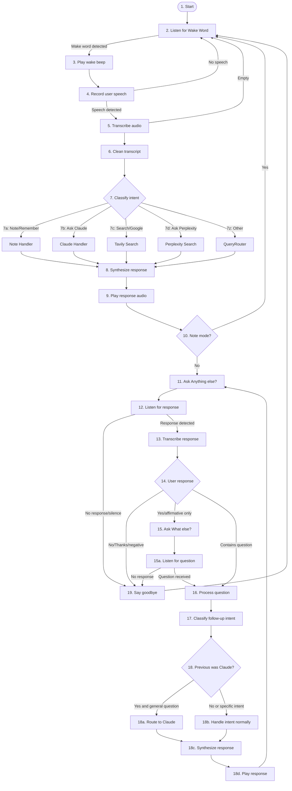
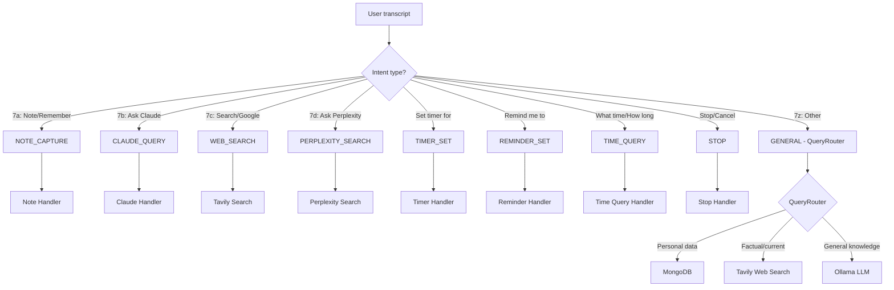
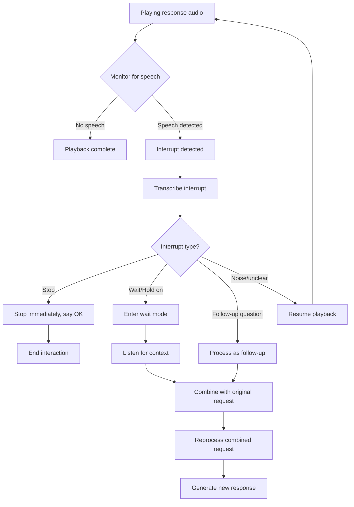
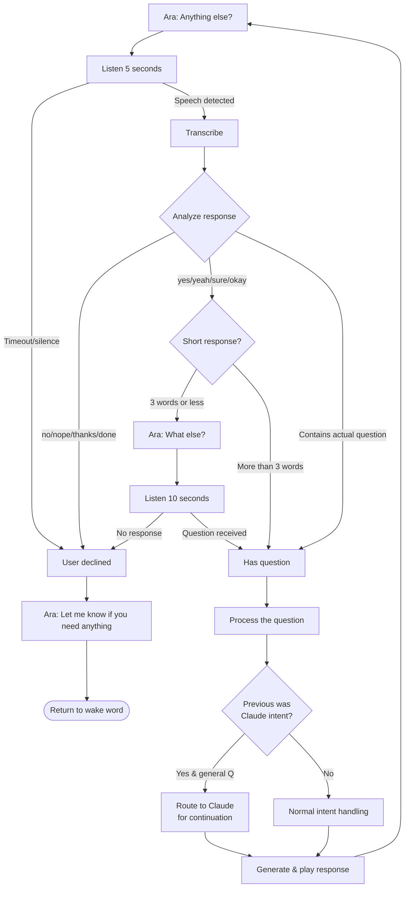
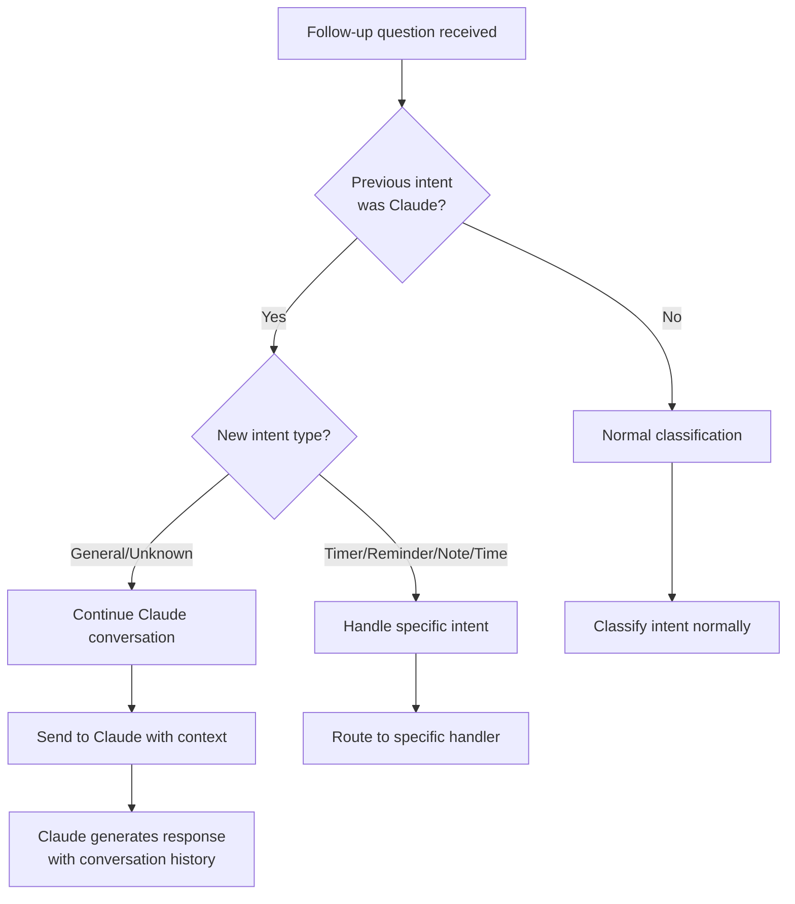
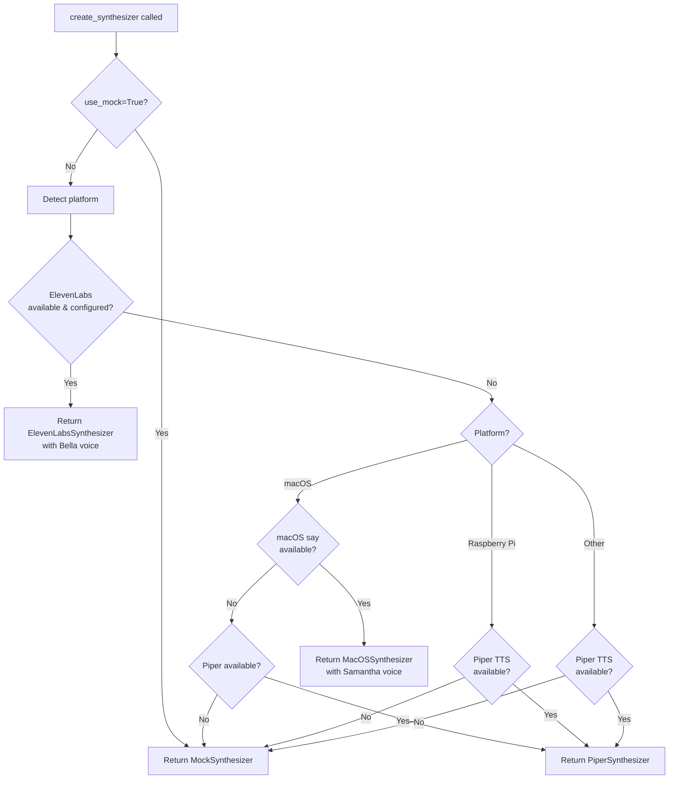
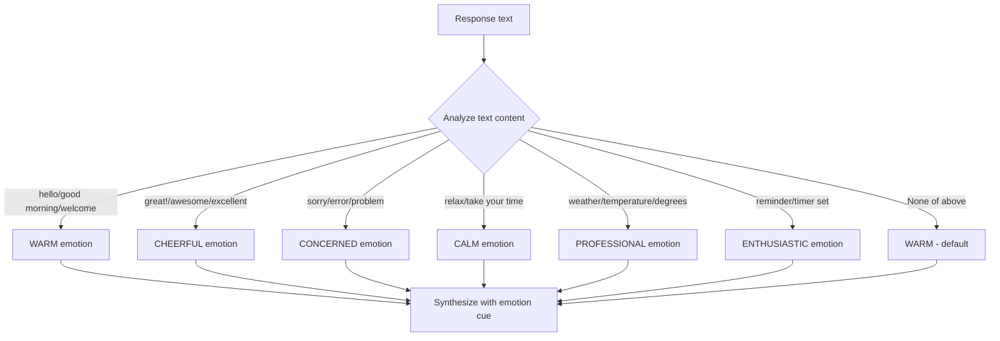

# Ara Conversation Flow

This document describes the complete conversation flow logic in Ara Voice Assistant.

## High-Level Flow

### Node Reference

| Node | Description |
|------|-------------|
| 1 | Start - Entry point |
| 2 | Listen for Wake Word - Awaiting "Hey Ara" |
| 3 | Play wake beep - Audio feedback |
| 4 | Record user speech - Capture audio |
| 5 | Transcribe audio - Speech-to-text |
| 6 | Clean transcript - Remove filler words |
| 7 | Classify intent - Route based on voice phrase |
| 7a | Note Handler - "Note that...", "Remember..." |
| 7b | Claude Handler - "Ask Claude...", "Hey Claude..." |
| 7c | Tavily Search - "Search for...", "Google..." |
| 7d | Perplexity Search - "Ask Perplexity..." |
| 7z | QueryRouter - Smart routing for other queries |
| 8 | Synthesize response - Generate TTS audio |
| 9 | Play response audio - Speak response |
| 10 | Note mode? - Check for continuation |
| 11 | Ask "Anything else?" - Prompt for follow-up |
| 12 | Listen for response - Wait for user reply |
| 13 | Transcribe response - Convert reply to text |
| 14 | User response - Decision point |
| 15 | Ask "What else?" - Prompt for question |
| 15a | Listen for question - Wait for follow-up |
| 16 | Process question - Handle follow-up |
| 17 | Classify follow-up intent - Categorize |
| 18 | Previous was Claude? - Check conversation context |
| 18a | Route to Claude - Continue Claude conversation |
| 18b | Handle intent normally - Standard processing |
| 18c | Synthesize response - Generate follow-up TTS |
| 18d | Play response - Speak follow-up |
| 19 | Say goodbye - End interaction |
| 22 | Say goodbye - End interaction |

## Detailed Intent Classification (Step 7 Routing)

### Step 7 Query Routing Reference

| Route | Trigger Phrases | Handler |
|-------|-----------------|---------|
| 7a Note | "note that...", "remember...", "add to action items" | MongoDB notes |
| 7b Claude | "ask Claude...", "hey Claude..." | Claude API |
| 7c Web Search | "search for...", "google...", "what's the weather..." | Tavily API |
| 7d Perplexity | "ask Perplexity...", "search with Perplexity..." | Perplexity API |
| 7z Default | Everything else | QueryRouter → MongoDB/Tavily/Ollama |

## Interrupt Handling Flow

## "Anything Else?" Decision Logic

## Claude Conversation Continuation

## TTS Synthesizer Selection

## Emotion Detection (ElevenLabs)

## Summary

The conversation flow in Ara follows these key principles:

1. **Wake word activation**: Conversation starts with wake word detection
2. **Intent-driven routing**: User speech is classified and routed to appropriate handlers
3. **Continuous conversation**: After each response, Ara asks "Anything else?" to continue
4. **Smart continuation**: Claude conversations are maintained across follow-ups
5. **Graceful fallbacks**: TTS and other components have fallback chains
6. **Interrupt handling**: Users can interrupt responses with "stop" or "wait"
7. **Emotional TTS**: ElevenLabs responses include emotion detection for natural speech
