# Ara Conversation Flow

This document describes the complete conversation flow logic in Ara Voice Assistant.

## High-Level Flow

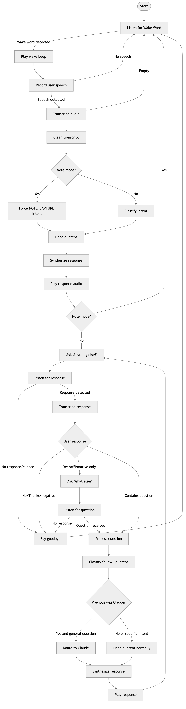

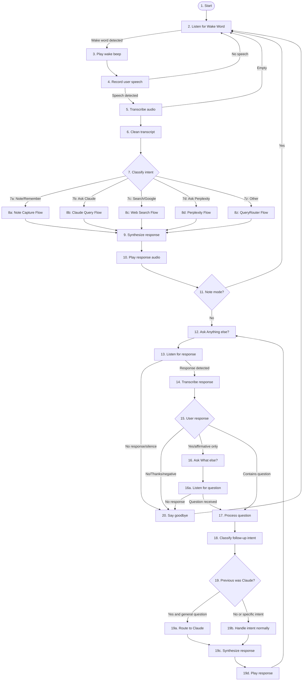

### Node Reference

| Node | Description |
|------|-------------|
| 1 | Start - Entry point |
| 2 | Listen for Wake Word - Awaiting "Hey Ara" |
| 3 | Play wake beep - Audio feedback |
| 4 | Record user speech - Capture audio |
| 5 | Transcribe audio - Speech-to-text |
| 6 | Clean transcript - Remove filler words |
| 7 | Classify intent - Route based on voice phrase |
| 8a | Note Capture Flow - See detailed diagram below |
| 8b | Claude Query Flow - See detailed diagram below |
| 8c | Web Search Flow - See detailed diagram below |
| 8d | Perplexity Flow - See detailed diagram below |
| 8z | QueryRouter Flow - See detailed diagram below |
| 9 | Synthesize response - Generate TTS audio |
| 10 | Play response audio - Speak response |
| 11 | Note mode? - Check for continuation |
| 12 | Ask "Anything else?" - Prompt for follow-up |
| 13 | Listen for response - Wait for user reply |
| 14 | Transcribe response - Convert reply to text |
| 15 | User response - Decision point |
| 16 | Ask "What else?" - Prompt for question |
| 16a | Listen for question - Wait for follow-up |
| 17 | Process question - Handle follow-up |
| 18 | Classify follow-up intent - Categorize |
| 19 | Previous was Claude? - Check conversation context |
| 19a | Route to Claude - Continue Claude conversation |
| 19b | Handle intent normally - Standard processing |
| 19c | Synthesize response - Generate follow-up TTS |
| 19d | Play response - Speak follow-up |
| 20 | Say goodbye - End interaction |

## Detailed Intent Classification (Step 7 Routing)

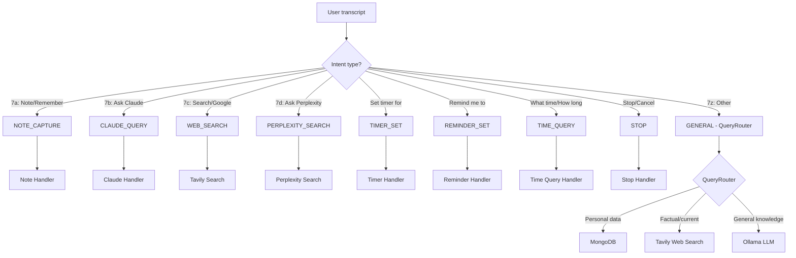

### Step 7 Query Routing Reference

| Route | Trigger Phrases | Handler |
|-------|-----------------|---------|
| 7a Note | "note that...", "remember...", "add to action items" | MongoDB notes |
| 7b Claude | "ask Claude...", "hey Claude..." | Claude API |
| 7c Web Search | "search for...", "google...", "what's the weather..." | Tavily API |
| 7d Perplexity | "ask Perplexity...", "search with Perplexity..." | Perplexity API |
| 7z Default | Everything else | QueryRouter → MongoDB/Tavily/Ollama |

## 7a: Note Capture Flow

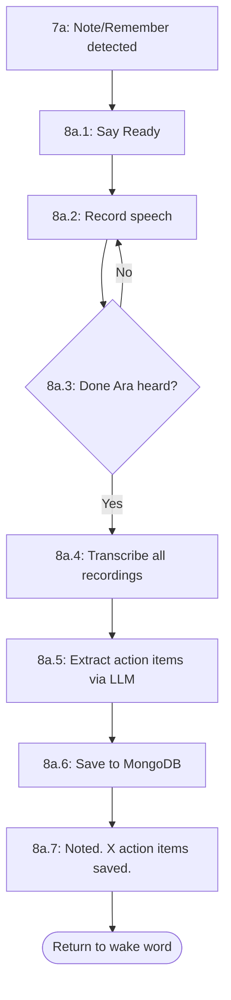

| Step | Description |
|------|-------------|
| 8a.1 | Confirm note mode with "Ready" |
| 8a.2 | Continuous recording of user speech |
| 8a.3 | Monitor for "Done Ara" stop phrase |
| 8a.4 | Transcribe accumulated audio |
| 8a.5 | Use LLM to extract action items from transcript |
| 8a.6 | Store notes and action items in MongoDB |
| 8a.7 | Confirm with count of action items saved |

## 7b: Claude Query Flow

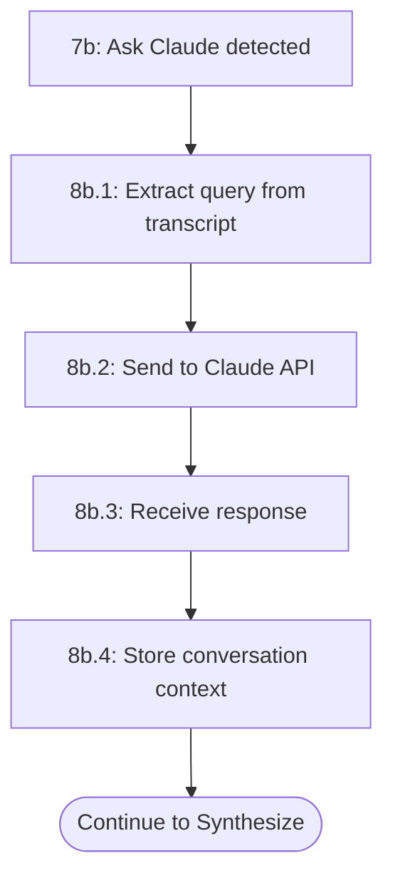

| Step | Description |
|------|-------------|
| 8b.1 | Parse user query from transcript |
| 8b.2 | Send query to Claude API with system prompt |
| 8b.3 | Receive Claude response |
| 8b.4 | Store context for follow-up questions |

## 7c: Web Search Flow (Tavily)

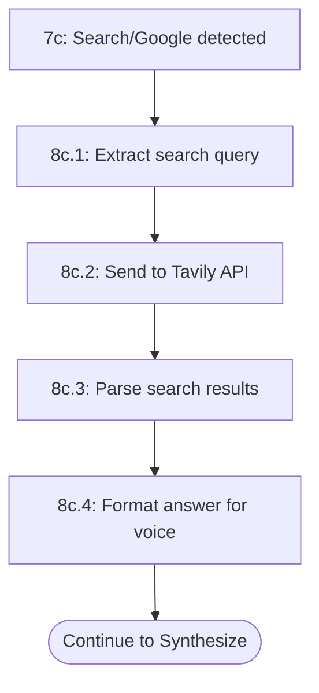

| Step | Description |
|------|-------------|
| 8c.1 | Extract search query from transcript |
| 8c.2 | Execute web search via Tavily API |
| 8c.3 | Parse and rank search results |
| 8c.4 | Format concise answer suitable for voice |

## 7d: Perplexity Search Flow

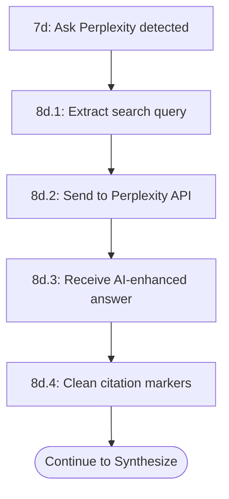

| Step | Description |
|------|-------------|
| 8d.1 | Extract search query from transcript |
| 8d.2 | Send query to Perplexity chat completions API |
| 8d.3 | Receive AI-synthesized answer with citations |
| 8d.4 | Remove [1][2] citation markers for clean voice output |

## 7z: QueryRouter Flow (Default)

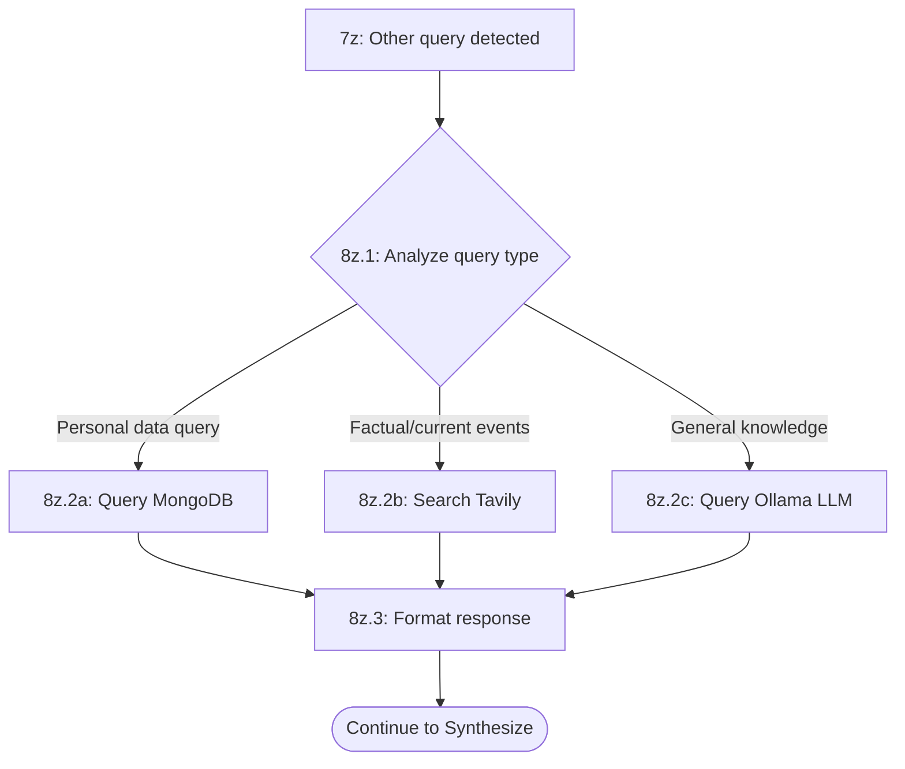

| Step | Description |
|------|-------------|
| 8z.1 | Classify query as personal, factual, or general |
| 8z.2a | Personal: Query MongoDB for notes, activities, etc. |
| 8z.2b | Factual: Execute web search via Tavily |
| 8z.2c | General: Generate response via local Ollama LLM |
| 8z.3 | Format response for voice output |

## Interrupt Handling Flow

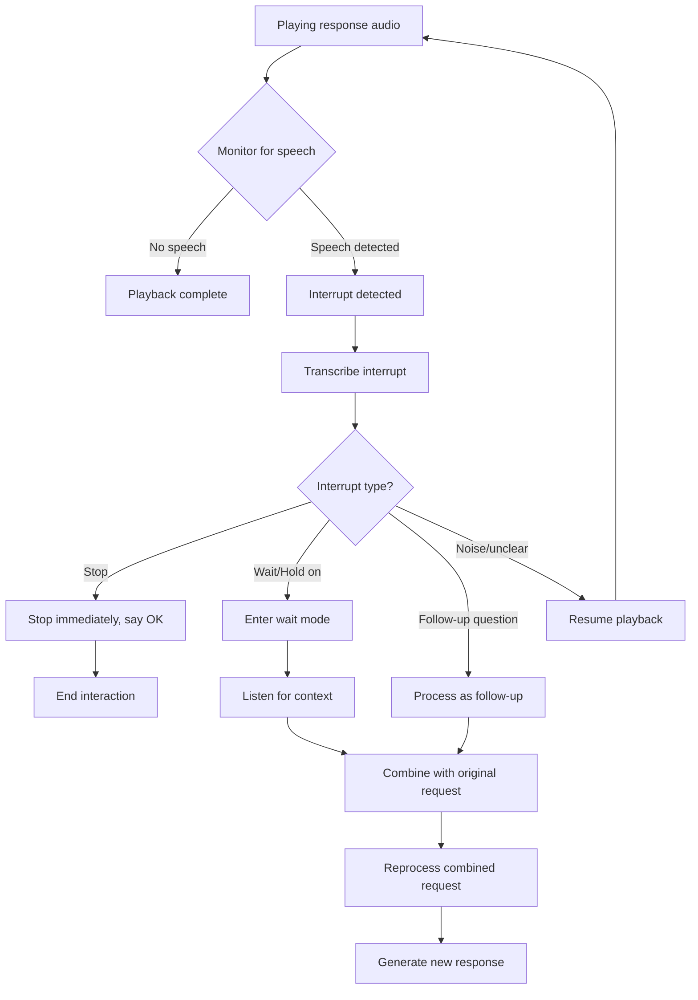

## "Anything Else?" Decision Logic

## Claude Conversation Continuation

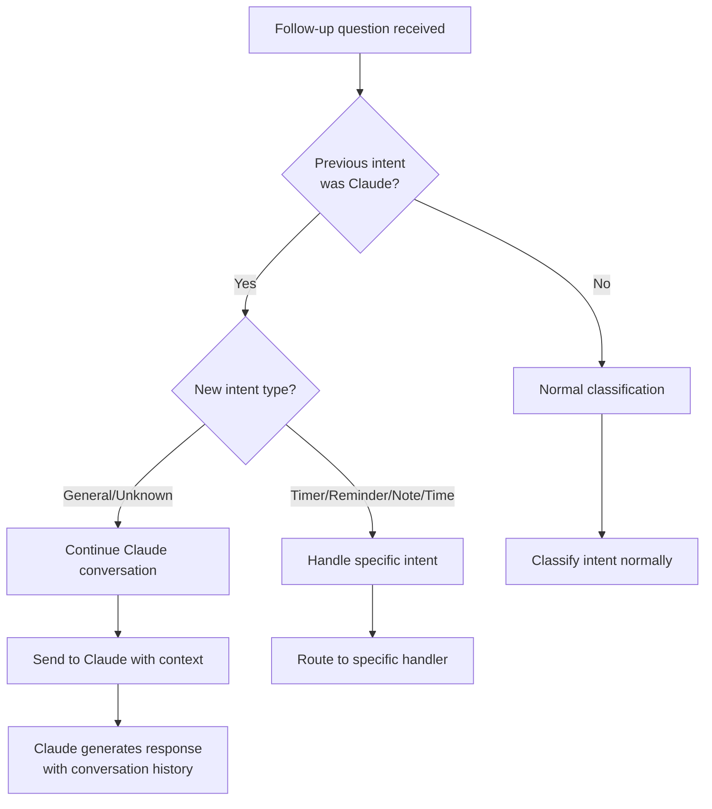

## TTS Synthesizer Selection

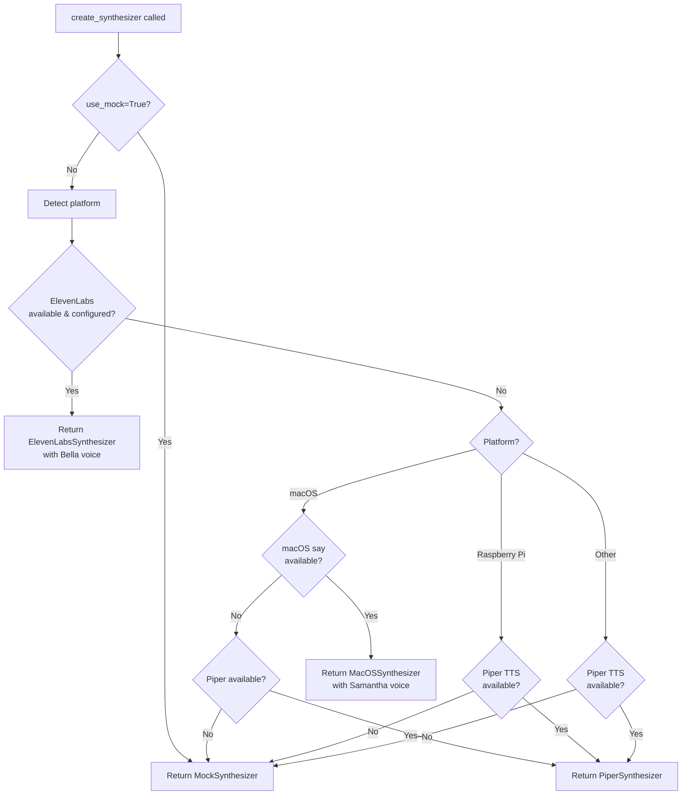

## Emotion Detection (ElevenLabs)

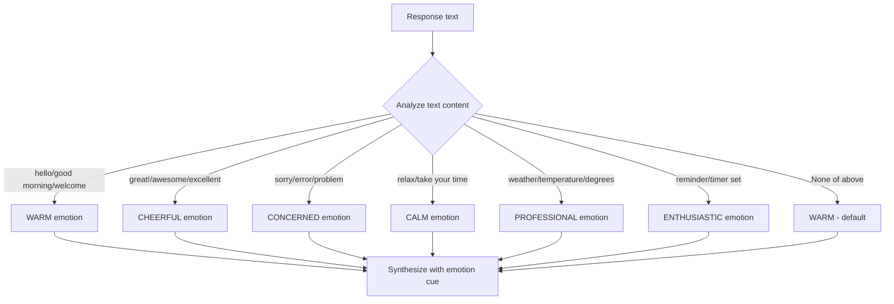

## Summary

The conversation flow in Ara follows these key principles:

1. **Wake word activation**: Conversation starts with wake word detection
2. **Intent-driven routing**: User speech is classified and routed to appropriate handlers
3. **Continuous conversation**: After each response, Ara asks "Anything else?" to continue
4. **Smart continuation**: Claude conversations are maintained across follow-ups
5. **Graceful fallbacks**: TTS and other components have fallback chains
6. **Interrupt handling**: Users can interrupt responses with "stop" or "wait"
7. **Emotional TTS**: ElevenLabs responses include emotion detection for natural speech
