# Ara Conversation Flow

This document describes the complete conversation flow logic in Ara Voice Assistant.

## High-Level Flow

```mermaid
flowchart TD
    START([Start]) --> LISTEN[Listen for Wake Word]
    LISTEN --> |Wake word detected| BEEP1[Play wake beep]
    BEEP1 --> RECORD[Record user speech]
    RECORD --> |No speech| LISTEN
    RECORD --> |Speech detected| TRANSCRIBE[Transcribe audio]
    TRANSCRIBE --> |Empty| LISTEN
    TRANSCRIBE --> CLEAN[Clean transcript]
    CLEAN --> MODE{Note mode?}

    MODE --> |Yes| NOTE_INTENT[Force NOTE_CAPTURE intent]
    MODE --> |No| CLASSIFY[Classify intent]

    NOTE_INTENT --> HANDLE_INTENT
    CLASSIFY --> HANDLE_INTENT[Handle intent]

    HANDLE_INTENT --> SYNTHESIZE[Synthesize response]
    SYNTHESIZE --> PLAY[Play response audio]

    PLAY --> NOTE_CHECK{Note mode?}
    NOTE_CHECK --> |Yes| LISTEN
    NOTE_CHECK --> |No| ANYTHING_ELSE[Ask 'Anything else?']

    ANYTHING_ELSE --> AE_LISTEN[Listen for response]
    AE_LISTEN --> |No response/silence| GOODBYE[Say goodbye]
    AE_LISTEN --> |Response detected| AE_TRANSCRIBE[Transcribe response]

    AE_TRANSCRIBE --> AE_CHECK{User response}
    AE_CHECK --> |"No"/"Thanks"/negative| GOODBYE
    AE_CHECK --> |"Yes"/affirmative only| PROMPT[Ask 'What else?']
    AE_CHECK --> |Contains question| PROCESS_FOLLOWUP[Process question]

    PROMPT --> PROMPT_LISTEN[Listen for question]
    PROMPT_LISTEN --> |No response| GOODBYE
    PROMPT_LISTEN --> |Question received| PROCESS_FOLLOWUP

    PROCESS_FOLLOWUP --> CLASSIFY_FOLLOWUP[Classify follow-up intent]
    CLASSIFY_FOLLOWUP --> CLAUDE_CHECK{Previous was Claude?}

    CLAUDE_CHECK --> |Yes & general question| ROUTE_CLAUDE[Route to Claude]
    CLAUDE_CHECK --> |No or specific intent| HANDLE_FOLLOWUP[Handle intent normally]

    ROUTE_CLAUDE --> SYNTH_FOLLOWUP[Synthesize response]
    HANDLE_FOLLOWUP --> SYNTH_FOLLOWUP

    SYNTH_FOLLOWUP --> PLAY_FOLLOWUP[Play response]
    PLAY_FOLLOWUP --> ANYTHING_ELSE

    GOODBYE --> LISTEN
```

## Detailed Intent Classification

```mermaid
flowchart TD
    TRANSCRIPT[User transcript] --> INTENT_CLASS{Intent type?}

    INTENT_CLASS --> |"Ask Claude..."| CLAUDE_QUERY[CLAUDE_QUERY]
    INTENT_CLASS --> |"Set timer for..."| TIMER_SET[TIMER_SET]
    INTENT_CLASS --> |"Remind me to..."| REMINDER_SET[REMINDER_SET]
    INTENT_CLASS --> |"Remember..."/"Note..."| NOTE_CAPTURE[NOTE_CAPTURE]
    INTENT_CLASS --> |"What time..."/"How long..."| TIME_QUERY[TIME_QUERY]
    INTENT_CLASS --> |"Search for..."/"What is..."| WEB_SEARCH[WEB_SEARCH]
    INTENT_CLASS --> |"What's the weather..."| WEATHER[WEATHER]
    INTENT_CLASS --> |"Stop"/"Cancel"| STOP[STOP]
    INTENT_CLASS --> |Other| GENERAL[GENERAL - Use LLM]

    CLAUDE_QUERY --> CLAUDE_HANDLER[Claude Handler]
    TIMER_SET --> TIMER_HANDLER[Timer Handler]
    REMINDER_SET --> REMINDER_HANDLER[Reminder Handler]
    NOTE_CAPTURE --> NOTE_HANDLER[Note Handler]
    TIME_QUERY --> TIME_HANDLER[Time Query Handler]
    WEB_SEARCH --> SEARCH_HANDLER[Search Handler]
    WEATHER --> WEATHER_HANDLER[Weather Handler]
    STOP --> STOP_HANDLER[Stop Handler]
    GENERAL --> LLM_HANDLER[LLM Handler]
```

## Interrupt Handling Flow

```mermaid
flowchart TD
    PLAYING[Playing response audio] --> MONITOR{Monitor for speech}

    MONITOR --> |No speech| COMPLETE[Playback complete]
    MONITOR --> |Speech detected| INTERRUPT[Interrupt detected]

    INTERRUPT --> INT_TRANSCRIBE[Transcribe interrupt]
    INT_TRANSCRIBE --> INT_CHECK{Interrupt type?}

    INT_CHECK --> |"Stop"| STOP_NOW[Stop immediately, say "OK"]
    INT_CHECK --> |"Wait"/"Hold on"| WAIT_MODE[Enter wait mode]
    INT_CHECK --> |Follow-up question| FOLLOWUP[Process as follow-up]
    INT_CHECK --> |Noise/unclear| RESUME[Resume playback]

    WAIT_MODE --> WAIT_LISTEN[Listen for context]
    WAIT_LISTEN --> COMBINE[Combine with original request]
    COMBINE --> REPROCESS[Reprocess combined request]

    FOLLOWUP --> COMBINE

    STOP_NOW --> END_INT[End interaction]
    RESUME --> PLAYING
    REPROCESS --> NEW_RESPONSE[Generate new response]
```

## "Anything Else?" Decision Logic

```mermaid
flowchart TD
    ASK["Ara: 'Anything else?'"] --> LISTEN[Listen 5 seconds]

    LISTEN --> |Timeout/silence| DECLINE[User declined]
    LISTEN --> |Speech detected| TRANSCRIBE[Transcribe]

    TRANSCRIBE --> ANALYZE{Analyze response}

    ANALYZE --> |Contains: no, nope, thanks,<br>that's all, goodbye, done| DECLINE
    ANALYZE --> |Contains: yes, yeah, sure,<br>okay, please, another| AFFIRM{Short response?}
    ANALYZE --> |Contains actual question| QUESTION[Has question]

    AFFIRM --> |≤3 words| PROMPT["Ara: 'What else can I help with?'"]
    AFFIRM --> |>3 words| QUESTION

    PROMPT --> LISTEN2[Listen 10 seconds]
    LISTEN2 --> |No response| DECLINE
    LISTEN2 --> |Question received| QUESTION

    QUESTION --> PROCESS[Process the question]

    DECLINE --> GOODBYE["Ara: 'Alright, let me know<br>if you need anything'"]
    GOODBYE --> END([Return to wake word])

    PROCESS --> CLAUDE_CHECK{Previous was<br>Claude intent?}

    CLAUDE_CHECK --> |Yes & general Q| ROUTE_CLAUDE[Route to Claude<br>for continuation]
    CLAUDE_CHECK --> |No| NORMAL[Normal intent handling]

    ROUTE_CLAUDE --> RESPOND[Generate & play response]
    NORMAL --> RESPOND

    RESPOND --> ASK
```



## Claude Conversation Continuation


## TTS Synthesizer Selection


## Emotion Detection (ElevenLabs)

```mermaid
flowchart TD
    TEXT[Response text] --> ANALYZE{Analyze text content}

    ANALYZE --> |"hello", "good morning",<br>"welcome"| WARM[WARM emotion]
    ANALYZE --> |"great!", "awesome",<br>"excellent"| CHEERFUL[CHEERFUL emotion]
    ANALYZE --> |"sorry", "error",<br>"problem"| CONCERNED[CONCERNED emotion]
    ANALYZE --> |"relax", "don't worry",<br>"take your time"| CALM[CALM emotion]
    ANALYZE --> |"weather", "temperature",<br>"degrees"| PROFESSIONAL[PROFESSIONAL emotion]
    ANALYZE --> |"reminder", "don't forget",<br>"timer set"| ENTHUSIASTIC[ENTHUSIASTIC emotion]
    ANALYZE --> |None of above| DEFAULT[WARM - default]

    WARM --> SYNTH[Synthesize with emotion cue]
    CHEERFUL --> SYNTH
    CONCERNED --> SYNTH
    CALM --> SYNTH
    PROFESSIONAL --> SYNTH
    ENTHUSIASTIC --> SYNTH
    DEFAULT --> SYNTH
```

## Summary

The conversation flow in Ara follows these key principles:

1. **Wake word activation**: Conversation starts with wake word detection
2. **Intent-driven routing**: User speech is classified and routed to appropriate handlers
3. **Continuous conversation**: After each response, Ara asks "Anything else?" to continue
4. **Smart continuation**: Claude conversations are maintained across follow-ups
5. **Graceful fallbacks**: TTS and other components have fallback chains
6. **Interrupt handling**: Users can interrupt responses with "stop" or "wait"
7. **Emotional TTS**: ElevenLabs responses include emotion detection for natural speech
